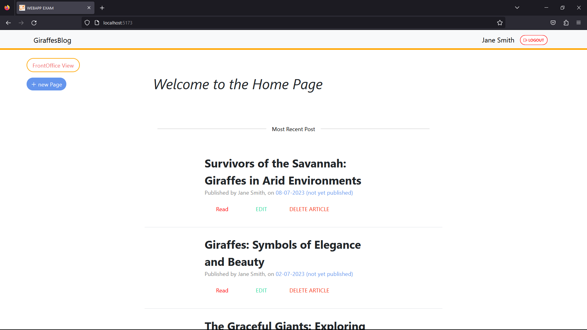
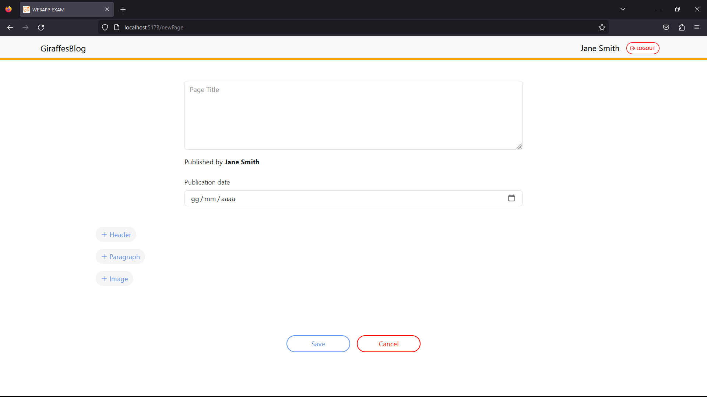

# Exam #1: "CMSmall"

## Student: s319834 GASPAROTTO NICOLA

# Server side

- The `images` present in the server are stored in the folder `./public/images/` and the client side can request them one by one,
  with a GET to `/static/images/imagename.png` and the server will send them back to the client.

## API Server

- GET `/api/pages`
  - request parameters: none
  - response body content: a list of all the pages in the database

- POST `/api/pages`
  - request body content: all the element needed to create a new page ( wihtout the pageId )

- GET `/api/pages/:pageId`
  - request parameters content: the page id
  - response body content: a list of all the pages in the database

- PUT `/api/pages/:pageId`
  - request body content: the page
  - response body content: true if the page is correctly updated

- DELETE `/api/pages/:pageId`
 - request body content: the page id

- GET `/api/contents/:contentId`
  - request parameters content: the content id
  - response body content: the content of the page

- POST `/api/checkauthor`
  - request body content: the name of the author passed from the client
  - response body content: true if the author is present in the database
 
- GET `/api/images`
  - response body content: a list of the names of all the images in the database

- GET `/api/blogname`
  - response body content: the name of the blog

- PUT `/api/blogname`
  - request body content: the name of the blog

- POST `/api/sessions`
  - request parameters: username and password
  - response body content: in case of a successful login, the user object

- GET `/api/sessions/:current`
  - response body content: if the user is logged in, the user object

- DELETE `/api/sessions/:current`
  - response body content: if the user is correctly logged out, a true value

## Database Tables

- Table `users` - contains all the user Information: `id, username, hash, salt, name, backOfficeView, admin`
- Table `pages` - contains all the infromation about the page: `idPage, title, author, creationDate, publicationDate`
- Table `contens` - contains all the content of the page: `idContent, idPage, type, content ( text or imageNamePath )`
- Table `blogname` - is Junk table that contains the name of the blog: `id, name`

# Client side

## React Client Application Routes

- Route `/`: main page with a navbar and a list of pages and it will be displayed in frontOffice view by Default.

             logged user will have another button to switch to the Backoffice view or back to FrontOffice view.
             ( this means that there is no need to have the different pages for the two views that share already a lot of components )

- Route `/pages/:pageId`: page with the content of the page and it will be displayed in frontOffice view
- Route `/newPage`: page with a form to create a new page and it will be displayed in backOffice view
- Route `/pages/:pageId/edit`: page with a form to edit a page and it will be displayed in backOffice view

- Route `/login`: page with a form to login
- Route `/*`: everything else that is not one of the previous valid routes will be redirected to a not found page

## Main React Components

- `WebPageForm` (in `WebPageForm.jsx`): component containing all the form needed to create a new page or edit an existing one.
- `Blog` (in `WebPages.jsx`): compontent that contains a table with all the pages stored and it is used as element of the Main Page layout.
- `WebPage` (in `WebPage.jsx`): compontent that contains all the element of a specific pages ( Title, Author, publicationDate, creationDate, the list of all the contents presents in the page), and buttons to go back to the main page, to edit the page or to delete it.
- `Login` ( in `Login.jsx`): component that contains the form to do the login and in case of successful login the page will be render back to the main page.
- `NavigationBar` ( in `Layouts.jsx`): component that contains the navbar with the name of the blog and the buttons to login or to logout the user.
- `PageNotFound` ( in `PageNotFound.jsx`): component that will be render in case of a wrong route.

# Usage info

## Example Screenshot

## Users Credentials

- janesmith@polito.it, pwdjane (`normal` user)
- johndoe@polito.it, pwdjohn (`normal` user)
- marcorossi@polito.it, pwdmarco (`normal` user)
- mikejohnson@polito.it, pwdmike (`admin` user)